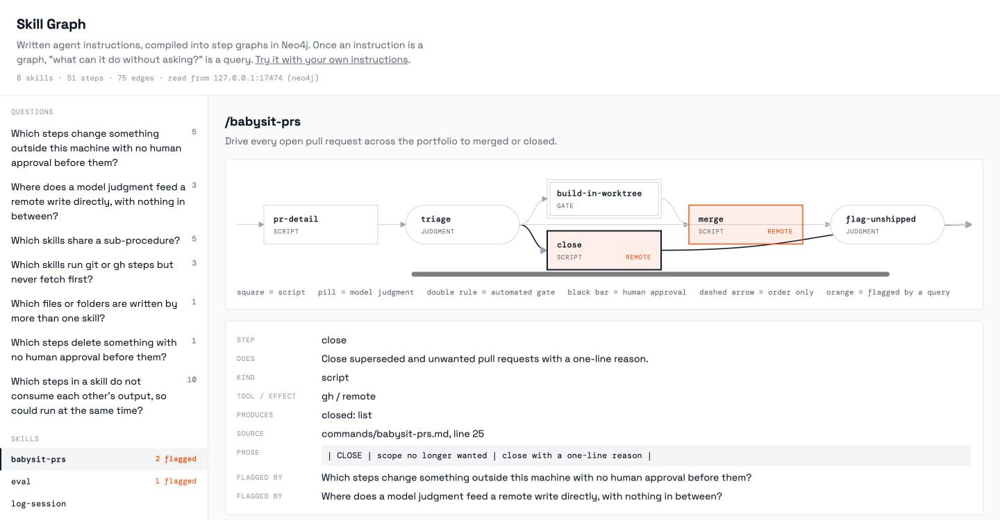
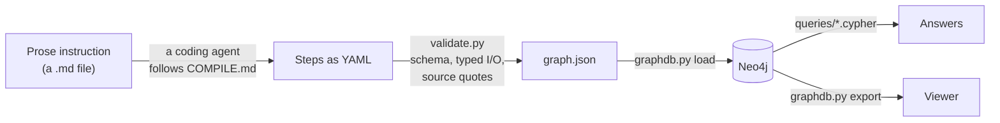
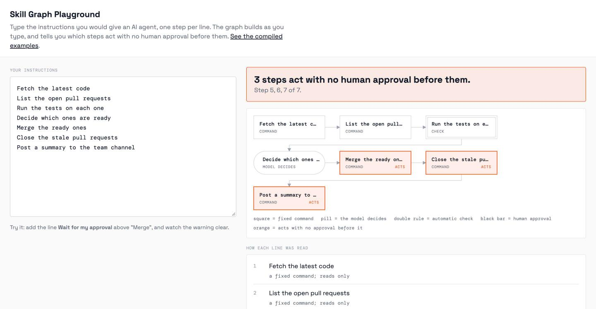

# Skill Graph

**What can your AI agent do without asking you?**

Agents follow written instructions: slash commands, skills, runbooks, system prompts.
Those instructions are prose, and you cannot ask prose a question. Skill Graph turns
them into a graph in Neo4j, so that "which steps act with no human approval before
them?" becomes a query with an answer.

- **Try it now, nothing to install:** [the playground](https://atharux.github.io/skill-graph/playground.html). Type instructions, watch the graph build, see what it flags.
- **Browse real examples:** [the viewer](https://atharux.github.io/skill-graph/). Eight of my own agent commands, compiled, with seven questions asked of them.



Built by [Athar Hafiz](https://atharux.com) for Graphs Gone Wild (Global AI Berlin
and Neo4j, 23 October 2026).

---

## What it found in my own agent

I run my work through Claude Code with 18 slash commands I wrote myself. I compiled
all 18 and asked the graph one question:

> Which steps change something outside my machine, with no human approval before them?

**Six.** Two of them have no automatic check either:

- `/babysit-prs` can **close a pull request** straight from the model's own verdict.
- `/plan-project` can **create GitHub issues** straight from the model's own draft.

A second question found that `/memory-check` can **delete the agent's own memory
files** with nobody approving the list.

I wrote all of these instructions and did not know any of this until I asked.

Eight of the 18 commands are published in [`examples/`](examples/), lightly edited
(local paths and private repository names replaced). On those eight the same query
returns **five** steps. The other ten contain client details and stay private.

---

## Why structure skills as graphs

This project applies an idea from Neo4j's work on the **Agent Instruction Protocol
(AIP)**, presented in their webinar on reusable skills and procedural memory. This
section summarises their argument as I understood it from the talk. The claims and
numbers in it are theirs, taken from their slides. I have not reproduced them.

### The problem with prose skills

A skill today is a Markdown file. The talk named four costs of that:

1. **Structure is implicit.** The order of steps, what each one needs and what it
   produces all live in prose, so the agent re-derives them in every session. That
   costs reliability and time.
2. **Improvement has no bounded surface.** When a skill misbehaves, there is no
   single step to point at and fix. You edit paragraphs and hope.
3. **Cause and effect are hard to establish.** Without addressable steps you cannot
   say which step failed, or which steps could safely run in parallel.
4. **There is no governance or traceability.** Nobody can list what a skill is
   allowed to do, or review it the way code is reviewed.

### What AIP changes

AIP extends the Agent Skills format. The `SKILL.md` becomes a schema-validated graph
of typed steps. Each step is either a deterministic script or a described judgment,
and steps are wired together by typed inputs and outputs. An agent does the
conversion, and the schema is the quality gate: ambiguity in the prose has to be
resolved before the graph is valid.

### What that buys you

- **Reliability.** On 27 SkillsBench tasks with 5 trials each, the talk reported the
  pass rate rising from 53.3% with the human-written skills to 67.4% with the compiled
  ones, with 12 wins, 13 ties and 2 losses, and the largest gain on hard tasks.
- **Governance as a query.** Their example questions were "which skills lack an
  approval step?" and "which skills share a sub-procedure?". Both are answered in this
  repository.
- **Provenance.** Every step can point back to where it came from.
- **Portability.** A graph of typed steps is not tied to one agent framework.
- **A closed loop.** Their Agent Memory Service distils new skills from traces of
  what agents actually did, with each step linked to the runs behind it.

### Where this repository sits

Skill Graph takes the governance and provenance parts of that idea and applies them
to one person's real instruction files. It is small on purpose.

| | Neo4j's AIP work | This repository |
|---|---|---|
| Skills become typed step graphs | yes | yes |
| Schema validates the result | yes | yes, plus a check that every step quotes its source line |
| Governance questions as Cypher | shown as examples | seven queries, run on real commands |
| Measured effect on agent performance | yes, benchmarked | **no, not measured** |
| Agent executes from the graph | yes | **no**, the graph is for inspection only |
| Skills distilled from real traces | yes | **no** |

It does not use their schema, their tooling or their hosted service, and it makes no
claim about making agents perform better.

---

## How it works



1. **Compile.** A coding agent reads one instruction file and writes it out as steps,
   following [`compile/COMPILE.md`](compile/COMPILE.md). Each step says what it does,
   whether it is a fixed command, a model judgment, an automatic check or a human
   approval, and whether it only reads or changes something outside the machine.
2. **Validate.** [`compile/validate.py`](compile/validate.py) rejects the result if a
   step consumes a value nothing produced, or if a step's quote is not found word for
   word in the source file. A step that cannot quote its source is treated as invented.
3. **Load.** [`compile/graphdb.py`](compile/graphdb.py) writes the steps into Neo4j
   over the HTTP Query API. No driver is needed, and it works the same against a local
   instance and Aura.
4. **Ask.** The Cypher in [`queries/`](queries/) answers the questions. The viewer
   shows what Neo4j returned and links each row to the step and the line of prose.

A compiled step looks like this:

```yaml
- id: close
  kind: script
  does: Close superseded and unwanted pull requests with a one-line reason.
  tool: gh
  effect: remote
  in: [verdicts]
  out: [{name: closed, type: list}]
  quote: '| CLOSE | scope no longer wanted | close with a one-line reason |'
```

---

## The seven questions

| Query | Question | Rows on the examples |
|---|---|---|
| [`01`](queries/01-remote-without-approval.cypher) | Which steps change something outside this machine with no human approval before them? | 5 |
| [`02`](queries/02-judgment-straight-to-remote.cypher) | Where does a model judgment feed a remote write directly? | 3 |
| [`03`](queries/03-shared-subprocedures.cypher) | Which skills share a sub-procedure? | 5 |
| [`04`](queries/04-repo-state-without-fetch.cypher) | Which skills run git or gh steps but never fetch first? | 3 |
| [`05`](queries/05-same-file-two-writers.cypher) | Which files are written by more than one skill? | 1 |
| [`06`](queries/06-destructive-without-approval.cypher) | Which steps delete something with no human approval before them? | 1 |
| [`07`](queries/07-could-run-in-parallel.cypher) | Which steps do not consume each other's output, so could run at the same time? | 10 |

The first one, in full:

```cypher
MATCH (s:SkillGraph:Command)-[:HAS_STEP]->(w:SkillGraph:Step {effect: "remote"})
WHERE NOT EXISTS {
  MATCH (a:SkillGraph:Step {kind: "approval", conditional: false})-[:INPUTS_TO|THEN*]->(w)
}
OPTIONAL MATCH (g:SkillGraph:Step {kind: "gate"})-[:INPUTS_TO|THEN*]->(w)
WITH s, w, collect(DISTINCT g.id) AS gates_before
RETURN s.name AS skill, w.id AS step, w.does AS does, gates_before
ORDER BY size(gates_before), skill, w.order
```

The answer depends on the path between steps, which is why this is a graph problem
and not a search over text.

---

## Run it on your own instructions

### The quick way

Open [the playground](https://atharux.github.io/skill-graph/playground.html) and type
your steps, one per line. It reads keywords in your browser and sends nothing
anywhere. It is a draft, not an audit: it can miss a risky step that is worded
unusually. Use "Copy as Cypher" to paste the result into Neo4j.



### The full way

You need Python 3 with `pyyaml` and `jsonschema`, and a Neo4j 5 database.
A free Aura instance or a local container both work.

```bash
git clone https://github.com/atharux/skill-graph && cd skill-graph
pip install pyyaml jsonschema

# a throwaway local Neo4j
docker run -d --rm --name skillgraph-neo4j \
  -p 127.0.0.1:17474:7474 -p 127.0.0.1:17687:7687 \
  -e NEO4J_AUTH=neo4j/skillgraph-local neo4j:5-community

export SKILLGRAPH_NEO4J_PASSWORD=skillgraph-local
python3 compile/validate.py       # checks examples/, writes build/graph.json
python3 compile/graphdb.py load
python3 compile/graphdb.py query
python3 compile/graphdb.py export # writes docs/data.js
open docs/index.html
```

Then point it at your own files:

1. Put your instruction files in a folder, for example `mine/commands/`.
2. Give a coding agent [`compile/COMPILE.md`](compile/COMPILE.md), the schema and one
   file at a time. It writes `mine/skills/<name>.yaml`. Copy
   `examples/skills/subprocedures.yaml` as a starting point for shared rules.
3. Run `python3 compile/validate.py --skills mine/skills --sources mine` until it passes.
4. **Review the labels yourself.** This is the step that matters. See Limits.
5. Load, query and export as above.

To use Aura, set `SKILLGRAPH_NEO4J_URL`, `SKILLGRAPH_NEO4J_USER` and
`SKILLGRAPH_NEO4J_DATABASE` as well, and pass `--allow-remote` to `load`. The loader
only deletes and rewrites nodes labelled `:SkillGraph`, so it is safe beside other
graphs in the same database.

---

## Graph model

```
(:Command)-[:HAS_STEP]->(:Step)                      kind, tool, effect, quote, line
(:Command)-[:DECLARES_INPUT]->(:Input)
(:Input|Step)-[:INPUTS_TO {name, type}]->(:Step)     typed data edges
(:Step)-[:THEN]->(:Step)                             order only
(:Step)-[:USES]->(:Procedure)                        a rule shared by several commands
(:Step)-[:READS|WRITES]->(:Resource)
(:Command)-[:HAS_NOTE]->(:Note)                      what the compile surfaced
```

Every node also carries `:SkillGraph`.

---

## Limits

- **It checks what is written, not what the agent did.** An agent can ignore a written
  approval step. Linking the graph to real run logs is the obvious next step and is
  not built.
- **The labels are a judgment.** Whether a step is a `script` or a `judgment`, `read`
  or `remote`, was decided by a model (Claude) when it compiled the files. The
  validator proves the structure and the quotes, not those calls. The counts above
  change if a label changes.
- **The published examples were compiled by Claude in one session and have not yet had
  a full human review.**
- **It reports, it does not prevent.** It will tell you a step has no approval. It
  will not add one.
- **The playground is keyword matching.** It is there to make the idea tangible in
  thirty seconds.
- **Nothing here is benchmarked.** See the table above.

---

## Repository layout

```
compile/COMPILE.md              how a coding agent turns prose into steps
compile/procedure.schema.json   the schema every compiled file must satisfy
compile/validate.py             the gate: schema, typed I/O, source quotes
compile/graphdb.py              load | query | export over the Neo4j HTTP Query API
queries/                        seven governance questions in Cypher
examples/commands/              eight prose commands (the source of truth)
examples/skills/                the same eight, compiled
docs/                           the viewer and the playground (served by GitHub Pages)
```

## Credits

- The idea of compiling prose skills into typed step graphs, and the governance
  questions it enables, come from Neo4j's Agent Instruction Protocol work.
- Built with Claude Code, which also did the compiling.

## License

MIT. See [LICENSE](LICENSE).
